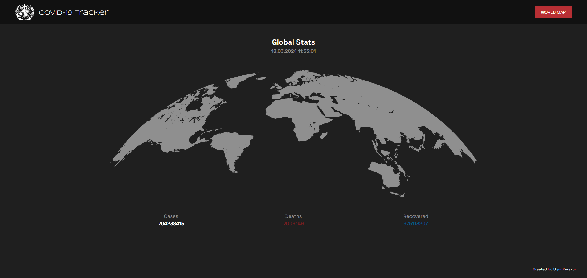
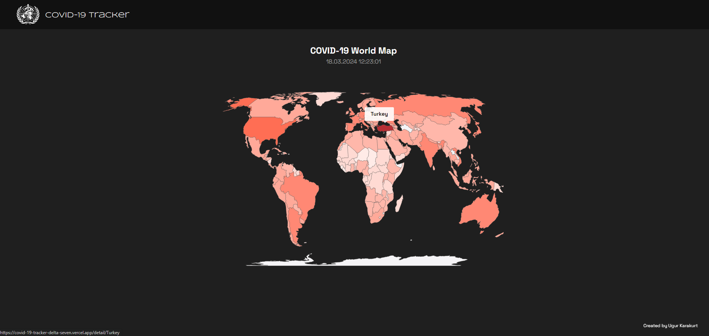
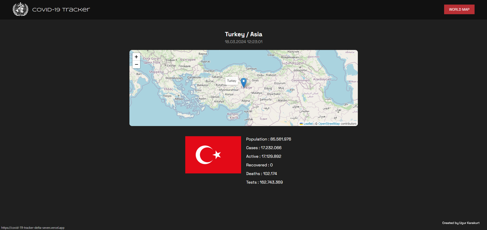

# Kartaca Case Study



## Covid-19 APP
### This project allows you to select covid-19 cases from around the world and see them by country.

<br>

Visit Project via Vercel= [The Covid-19 Tracker](https://covid-19-tracker-delta-seven.vercel.app/)<br>

Pull the Docker Image `docker pull zeves/covid-19-tracker:latest`

<br>

#### A project was created with Covid-19 data.

- The project is coded in Next.js (14.1.3).
- Typescript was used.
- The project itself was also deployed on Vercel.
- Docker deployment was also done. The necessary configuration was made to dockerize.
- In the project, a dynamic structure was established by paying attention to React rendering and state management. Redux Toolkit was used to provide and manage this structure.
- Axios was used for fetch requests.
- Redux-saga was used for middleware.
- The world map World Atlas TopoJSON was used and the map was dynamically generated with react-simple-maps.
- React Leaflet was used for the detail page.
- Sass was used for the css part.
- Framer Motion was used for animations.
- Functional coding was used throughout the project. In this context, the operations to be performed with auxiliary functions were written under the utils folder.
- General and simple component rendering tests were written.
- Skeleton structure was used for Custom 404 pages and Loading.
- Although it is not a responsive design, responsive feature has been added.


<br>

## Dependencies

- React.js
- Next.js
- Styled Reset (Sass)
- Axios
- Framer Motion
- React Leaflet
- React Simple Map
- Redux Tooltip
- Redux
- Redux Saga
- Sass

<br>

## Installation

```bash
npm install
npm run build
npm run dev
```

## ScreenShots

Some in-app images

| Image 1                               | Image 2                               |
| ------------------------------------- | ------------------------------------- |
|  |  |
| List Page                              | Filtered Homepage                     |
